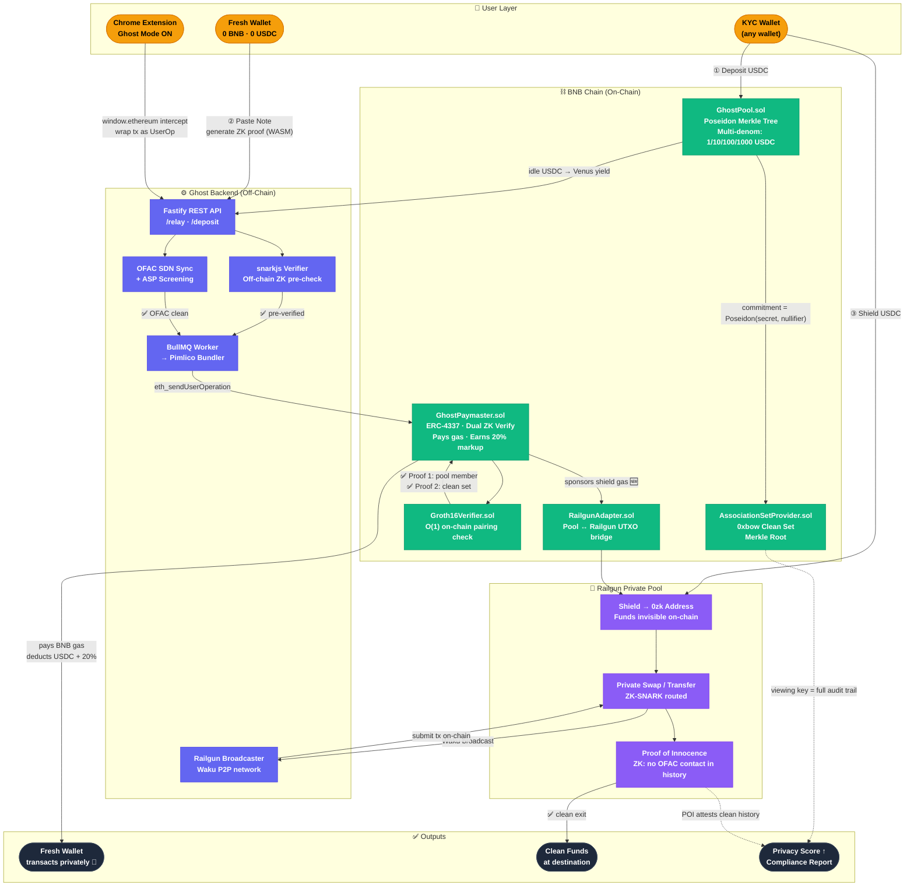

<div align="center">

# 👻 Ghost Full-Stack Privacy Suite for BNB Chain

### Gas Relayer · Privacy Wallet SDK · Railgun-Powered Private Transactions

[](https://www.bnbchain.org/)
[](https://eips.ethereum.org/EIPS/eip-4337)
[](https://docs.circom.io/)
[](https://railgun.org/)
[](https://0xbow.io/)

> **BNB Chain × YZI Labs Hack Bengaluru — Track 4: Privacy Solutions (4.1 · 4.2 · 4.3)**

*One privacy layer. Three components. Fully compliant. Gasless by default.*

</div>

---

## 🚀 What is Ghost?

Ghost is a **compliant, full-stack privacy infrastructure** for BNB Chain. It lets any wallet transact with zero on-chain identity exposure — without sacrificing regulatory compliance.

| Track | What We Built | Key Innovation |
|-------|---------------|----------------|
| **4.1** Gas Relayer | `GhostPaymaster.sol` — ERC-4337 Paymaster + ZK-backed Privacy Pool | **Dual-proof ASP model** (0xbow) — proves you're in the clean set, not just the pool |
| **4.2** Privacy SDK | `@ghost-privacy/sdk` — TypeScript SDK + `PrivacyProvider` React component | **One component** drops into any Next.js DApp |
| **4.3** Railgun | Gasless Railgun shield/unshield + Waku Broadcaster + Proof of Innocence | **Ghost Paymaster sponsors Railgun gas** — nobody else has this |

---

## 🔑 Key Features

- 🔒 **ZK Privacy Pool** — Deposit USDC, get a Note. Use the Note to pay gas from a fresh wallet. Zero on-chain link.
- ⛽ **Gasless Transactions** — ERC-4337 Paymaster covers BNB gas. Fresh wallets need zero BNB to transact.
- 🏛️ **0xbow ASP Compliance** — Users prove membership in a cryptographically-attested "Clean Set", not just the pool. Regulators get viewing keys.
- 🚂 **Gasless Railgun** — Ghost Paymaster sponsors Railgun shield/unshield gas. First of its kind.
- 🕵️ **Proof of Innocence** — On unshield, ZK-prove your full Railgun history never touched sanctioned funds.
- 📦 **Drop-in SDK** — `<PrivacyProvider>` gives any existing DApp a Ghost Mode toggle in one line.
- 👻 **Chrome Extension** — Auto-routes every MetaMask transaction through Ghost. Privacy without thinking.
- 📊 **Privacy Score** — 0–100 wallet exposure meter. Shareable. Viral.

---

## 🔄 How It Works

### System Flow



### User Journey (3 Steps)

```
Step 1 — DEPOSIT (from any wallet, one time)
  Any wallet  →  Deposit 10 USDC  →  GhostPool.sol
                                      ↓
                              Get a "Note" (save this)
                              OFAC check → added to Clean Set

Step 2 — USE (from fresh wallet, zero BNB)
  Fresh wallet (0 BNB)
    → paste Note → generate ZK proof locally (never leaves browser)
    → Proof 1: "I'm in the pool"
    → Proof 2: "I'm in the clean set"  ← 0xbow compliance
    → Ghost Paymaster pays gas → tx executes → zero link to depositor 👻

Step 3 — PRIVATE DEFI (via Railgun)
  → Shield USDC into Railgun  (Ghost pays the shield gas 🆕)
  → Private swap / transfer inside Railgun shielded pool
  → Unshield + Proof of Innocence → clean exit
```

---

## 💸 Business Model

Ghost earns on every transaction — it never actually "sponsors" gas for free.

```
User Action                 Ghost Earns
────────────────────────────────────────────────────
Deposit N USDC            → 0.5% protocol fee
                          + yield on idle USDC (Venus Protocol)
Relay via Paymaster       → 20% markup on actual gas cost
Railgun shield/unshield   → 20% markup on gas
Railgun broadcast         → Broadcaster tip per tx
SDK high-volume DApps     → Tiered SaaS (Alchemy model)
Compliance report export  → Per-export fee (institutional)
```

> At 5,000 daily relay txs × $0.24 margin = **$438K/year in gas markup alone**. Plus yield on TVL. Plus SDK SaaS. Zero token dependency.

---

## 🏛️ Architecture

```
┌─────────────────────────────────────────────────────────────┐
│                      ENTRY POINTS                           │
│  Next.js dApp  │  @ghost-privacy/sdk  │  Chrome Extension  │
└────────────────────────┬────────────────────────────────────┘
                         │
┌────────────────────────▼────────────────────────────────────┐
│                   GHOST BACKEND (Fastify)                    │
│  /v1/relay  │  /v1/pool/deposit  │  /v1/railgun/shield      │
│  OFAC sync  │  snarkjs verifier  │  BullMQ + Pimlico        │
│  Nullifier store (Redis)         │  Waku Broadcaster        │
└──────────┬──────────────────┬──────────────────┬────────────┘
           │                  │                  │
┌──────────▼──────────────────▼──────────────────▼────────────┐
│                        BNB CHAIN                             │
│  GhostPool.sol          GhostPaymaster.sol   ASP.sol        │
│  GhostPool ← USDC       ERC-4337 Paymaster   Clean Set      │
│  Merkle tree            Dual ZK proof verify  Merkle Root    │
│  Multi-denomination     Pays gas + earns 20%  0xbow model   │
│  (1/10/100/1000 USDC)                                       │
│                                                              │
│  Groth16Verifier.sol    RailgunAdapter.sol   GhostNameSvc   │
│  O(1) on-chain verify   Pool ↔ Railgun UTXO  ghost://name   │
└──────────────────────────────────────────────────────────────┘
```

---

## 📦 Project Structure

```
BNB/
├── contracts/                   # Solidity — Track 4.1 + 4.3
│   ├── GhostPool.sol            # Privacy pool, Poseidon Merkle tree
│   ├── GhostPaymaster.sol       # ERC-4337 Paymaster, dual ZK proof
│   ├── AssociationSetProvider.sol  # 0xbow Clean Set Merkle root
│   ├── Groth16Verifier.sol      # snarkjs auto-generated verifier
│   ├── RailgunAdapter.sol       # GhostPool ↔ Railgun UTXO bridge
│   └── GhostNameService.sol     # ghost://username registry
│
├── circuits/
│   └── merkle_proof.circom      # Poseidon circuit, depth-20, Groth16
│
├── backend/                     # Node.js Relayer — Track 4.1 + 4.3
│   ├── src/routes/              # REST API endpoints
│   ├── src/compliance/          # OFAC sync + ASP screening
│   ├── src/zk/                  # snarkjs off-chain pre-verification
│   ├── src/workers/             # BullMQ + Pimlico bundler
│   ├── src/railgun/             # Waku broadcaster + POI generation
│   └── src/yield/               # Idle USDC → Venus Protocol
│
├── sdk/                         # TypeScript SDK — Track 4.2
│   ├── src/GhostWallet.ts       # Spending key + viewing key
│   ├── src/ProofBuilder.ts      # In-browser WASM Groth16 proving
│   ├── src/UserOpBuilder.ts     # ERC-4337 UserOp with dual ZK proof
│   └── src/react/               # PrivacyProvider + useGhostWallet hook
│
├── frontend/                    # Next.js DApp — Track 4.1 + 4.2 + 4.3
│   ├── Deposit + Note backup
│   ├── ZK proof generation (WASM progress bar)
│   ├── Railgun shield/unshield/swap UI
│   ├── Privacy Score Dashboard (0–100, shareable)
│   ├── Ghost Name Service (ghost://username)
│   └── Compliance Report (viewing key export PDF)
│
└── extension/                   # Chrome Extension — Ghost Mode
    ├── manifest.json            # Manifest V3
    ├── popup/                   # Toggle + Privacy Score badge
    └── content/interceptor.ts   # window.ethereum tx interceptor
```

---

## ⚡ Quick Start

```bash
# Install
git clone https://github.com/your-org/ghost-privacy.git && cd ghost-privacy
npm install --prefix backend && npm install --prefix contracts
npm install --prefix sdk && npm install --prefix frontend

# Compile ZK circuit
cd circuits
circom merkle_proof.circom --r1cs --wasm --sym
snarkjs groth16 setup merkle_proof.r1cs pot12_final.ptau circuit.zkey
snarkjs zkey export solidityverifier circuit.zkey ../contracts/Groth16Verifier.sol

# Deploy contracts to BNB Testnet
cd ../contracts && npx hardhat run scripts/deploy.ts --network bsc-testnet

# Run
cd ../backend && npm run dev          # API server :3001
cd ../backend && npm run worker       # BullMQ relay worker
cd ../frontend && npm run dev         # dApp :3000
```

---

## 🧑‍💻 Developer Integration (SDK)

```bash
npm install @ghost-privacy/sdk
```

```tsx
// Option A — Drop-in React component (zero config)
import { PrivacyProvider } from '@ghost-privacy/sdk/react'

export default function App() {
  return (
    <PrivacyProvider chainId={56}>  {/* BNB Chain */}
      <YourExistingDApp />
      {/* ↑ Users now get a Ghost Mode toggle automatically */}
    </PrivacyProvider>
  )
}

// Option B — Full control
import { GhostWallet, ProofBuilder, GhostClient } from '@ghost-privacy/sdk'

const wallet  = new GhostWallet()         // spending + viewing keys
const { note } = await GhostClient.deposit({ amount: 10, token: 'USDC' })
const proof   = await ProofBuilder.generate(note, merkleTree)
await GhostClient.relay({ wallet, proof, callData })

// Compliance — share viewing key with auditor
const viewingKey = wallet.exportViewingKey()
// Auditor sees full tx history. Public chain: still sees nothing.
```

---

## ✅ Compliance

Ghost implements the **0xbow ASP model** — privacy that's cryptographically compliant.

```
Tornado Cash (non-compliant):  prove "I'm in the pool"
Ghost (0xbow compliant):       prove "I'm in the pool"  ✅
                             + prove "I'm in the clean set" ✅  ← ASP
                             + Proof of Innocence on exit ✅   ← Railgun POI
                             + Viewing keys for regulators ✅
```

| Screen | Mechanism |
|--------|-----------|
| OFAC SDN | Every deposit/relay address checked, list synced every 60 min |
| ASP Clean Set | Only OFAC-clean commitments enter the Merkle root |
| Proof of Innocence | ZK-prove full Railgun tx graph never touched flagged inputs |
| Viewing Keys | Share `viewingKey` with auditor — they see all history, chain sees nothing |

---

## 📚 References

| Resource | Why |
|----------|-----|
| [EIP-4337](https://eips.ethereum.org/EIPS/eip-4337) | Account Abstraction / UserOperation standard |
| [0xbow ASP Model](https://0xbow.io/) | Compliance framework used for Ghost's Clean Set |
| [Railgun Protocol](https://railgun.org/) | Private DeFi + Proof of Innocence |
| [Pimlico Bundler](https://docs.pimlico.io/) | ERC-4337 bundler for UserOp relay |
| [Circom](https://docs.circom.io/) | ZK circuit toolchain |
| [Venus Protocol](https://venus.io/) | BNB Chain yield for idle pool USDC |

---

<div align="center">

Built for **BNB Chain × YZI Labs Hack Bengaluru · Track 4 — Privacy Solutions**

*"Privacy is not about hiding. It's about choosing what to share, and with whom."*

**👻 Ghost — Compliant privacy. Gasless by default. Invisible to the chain.**

</div>